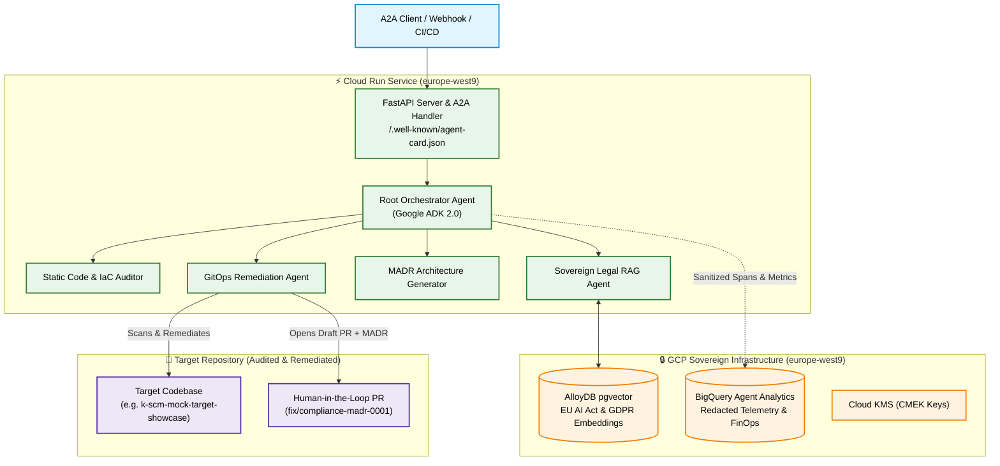

# 🏛️ K-SCM — Sovereign Compliance Mesh

[-blue?logo=googlecloud&logoColor=white)](https://cloud.google.com/about/locations/paris)
[](https://cloud.google.com/products/agent-development-kit)
[](https://python.org)
[](https://opensource.org/licenses/Apache-2.0)
[](https://k-scm-gjaydimv2q-od.a.run.app/.well-known/agent-card.json)

> **Autonomous multi-agent compliance mesh for automated EU AI Act & GDPR audits, architectural decision generation (MADR), and Human-in-the-Loop GitOps remediation on Google Cloud Platform.**

Developed by **[Kerdjou Tigroudja](https://kerdjou.dev)** (`contact@kerdjou.dev`).

---

## 📌 Executive Overview

**K-SCM (Sovereign Compliance Mesh)** is an enterprise-grade agentic system designed to help engineering and compliance teams automatically audit software codebases and Terraform IaC configurations against strict European regulations (**EU AI Act — Regulation 2024/1689** and **GDPR — Regulation 2016/679**).

### Key Differentiators:
1. **Strict European Data Sovereignty :** Compute (Cloud Run), storage (Cloud Storage CMEK), vector embeddings (AlloyDB pgvector), and telemetry (BigQuery) are hosted strictly in the **`europe-west9` (Paris, France)** region.
2. **Multi-Agent Orchestration (Google ADK 2.0) :** Specialized autonomous agents coordinate via standardized protocols (Agent-to-Agent A2A Card, JSON-RPC streaming).
3. **Human-in-the-Loop GitOps Remediation :** Generates non-destructive pull requests containing corrected source files and formal Architectural Decision Records (MADR) for peer review.
4. **Privacy-Preserving Telemetry :** Custom OpenTelemetry & BigQuery redacting pipeline ensuring 0% token leakage of secrets, API keys, or personal data.

---

## 🏗️ System Architecture



---

## 🚀 Live Production Endpoints

K-SCM is live and deployed in production on Google Cloud Run:

| Endpoint | Description | URL |
|---|---|---|
| **Agent-to-Agent (A2A) Card** | Machine-readable capabilities descriptor | [`https://k-scm-gjaydimv2q-od.a.run.app/.well-known/agent-card.json`](https://k-scm-gjaydimv2q-od.a.run.app/.well-known/agent-card.json) |
| **A2A Streaming Protocol** | JSON-RPC 2.0 streaming agent execution | `https://k-scm-gjaydimv2q-od.a.run.app/a2a/app/` |
| **Health Probe** | Service readiness & location verification | `https://k-scm-gjaydimv2q-od.a.run.app/health` |

---

## 💻 Local Quickstart & Test Suite

### 1. Prerequisites
- Python 3.12+
- `uv` package manager (`curl -LsSf https://astral.sh/uv/install.sh | sh`)

### 2. Setup & Installation
```bash
git clone https://github.com/kerdjou-tigroudja/k-scm-showcase.git
cd k-scm-showcase

# Install dependencies in isolated virtual environment
uv sync
```

### 3. Run Autonomous Unit Test Suite (38 tests, 100% Mocked/Offline)
```bash
uv run pytest tests/unit/ -v
```

---

## 📄 Architectural Decision Records (MADR)

Key architectural decisions are documented in [`docs/adr/`](docs/adr/):
- **[ADR-001: Sovereign Multi-Agent Architecture on Google ADK 2.0](docs/adr/ADR-001-sovereign-adk-architecture.md)**
- **[ADR-002: Sovereign Regulatory Vector Store using AlloyDB pgvector](docs/adr/ADR-002-alloydb-pgvector-retrieval.md)**
- **[ADR-003: Human-in-the-Loop GitOps Remediation Protocol](docs/adr/ADR-003-human-in-the-loop-gitops-remediation.md)**

---

## 🔗 Related Repositories & Portfolio

* **Target Sandbox Repository :** [`kerdjou-tigroudja/k-scm-mock-target-showcase`](https://github.com/kerdjou-tigroudja/k-scm-mock-target-showcase)
* **Official Web Hub :** [https://kerdjou.dev](https://kerdjou.dev)
* **Author Contact :** [contact@kerdjou.dev](mailto:contact@kerdjou.dev)
